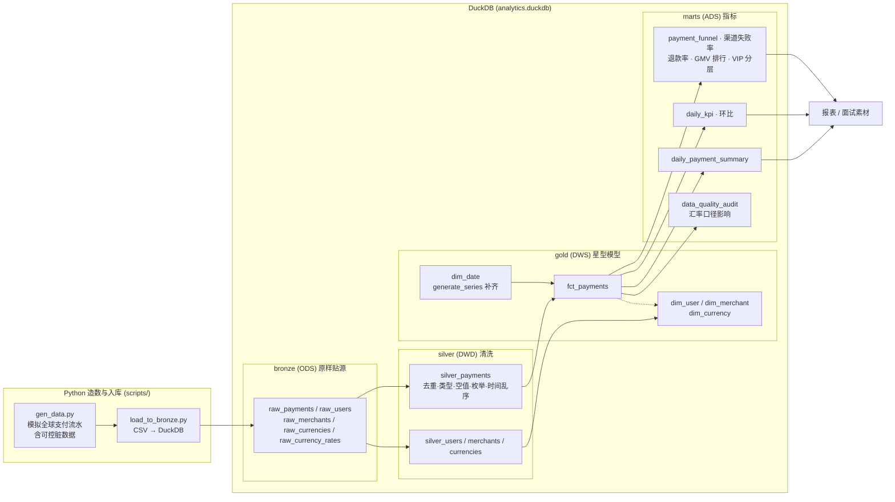

# Payment Analytics — 端到端支付交易数仓（dbt + DuckDB）

> 模拟全球支付流水（50 万行）→ DuckDB Bronze 贴源 → dbt 四层数仓（Bronze/Silver/Gold/Marts）
> → 星型模型 → 业务指标 → 数据质量测试 → 血缘图。
>
> 一个从 0 到 1 的离线数仓项目，用「支付交易」主题串起 **SQL + data warehousing + 数据质量**，
> 核心材料：**分层、星型建模、指标口径、数据清洗、慢查询优化**。

---

## 1. 架构图



**dbt 自动血缘**：`dbt docs generate` 后 `dbt docs serve`，可在线查看全部 24 张模型的血缘图。

---

## 2. 技术栈与选型

| 技术 | 版本 | 用途 | 选型理由 |
|---|---|---|---|
| Python | 3.12 | 造数 / 入库 | 生态成熟，`csv` + `duckdb` 原生读取，快且免 pandas 内存 |
| DuckDB | 1.5.5 | OLAP 数仓载体 | **列式存储、单文件、`pip install` 免运维**；本地两周内把精力放建模而非运维 |
| dbt-core + dbt-duckdb | 1.12.3 / 1.11.0 | 数仓建模 / ELT 的 T | **ref() 依赖 + 自动血缘 + 数据质量测试 + 文档**，数仓"工程化"的体现 |
| Git + GitHub | — | 版本管理 / 作品展示 | 面试门面 |

**为什么不用 MySQL？** MySQL 是行存 OLTP，聚合慢、要装服务；DuckDB 列存 OLAP，分析查询天然快。
**为什么 ELT 而不是 ETL？** 先原样加载再在数仓内转换，源系统轻、利用数仓算力（DuckDB），dbt 即 ELT 工具。

---

## 3. 目录结构

```
payment_analytics/
├── scripts/
│   ├── gen_data.py          # 生成原始 CSV（50 万行支付 + 维表，含可控脏数据）
│   └── load_to_bronze.py    # CSV → DuckDB bronze 层（原样贴源，幂等）
├── models/
│   ├── sources.yml          # bronze 源声明
│   ├── bronze/              # 5 张贴源视图
│   ├── silver/              # 5 张清洗表（含清洗打标列）
│   ├── gold/
│   │   ├── dim/             # dim_user / dim_merchant / dim_date / dim_currency
│   │   └── fact/            # fct_payments
│   ├── marts/               # 9 张指标 / 报表 / 审计模型
│   └── **/schema.yml        # 数据质量测试定义（generic tests）
├── tests/                   # 5 个自定义单测（singular tests）
├── data/                    # 原始 CSV（gitignore，可随时重建）
├── docs/                    # 文档与图
├── dbt_project.yml
└── README.md
```

---

## 4. 快速开始

```bash
# 1. 环境
pip install duckdb dbt-core dbt-duckdb
# Windows 下如有中文编码问题，先 export PYTHONUTF8=1

# 2. 造数 + 入库（→ analytics.duckdb 的 bronze 层）
python scripts/gen_data.py
python scripts/load_to_bronze.py

# 3. 建模（bronze → silver → gold → marts，共 24 个模型）
dbt run

# 4. 数据质量测试（52 个，含 5 个自定义监控测试）
dbt test

# 5. 血缘图 / 文档
dbt docs generate
dbt docs serve
```

---

## 5. 数据说明

`gen_data.py` 模拟全球支付流水：**50 万笔支付 × 近 90 天**、5 万名用户、2000 家商户、
22 个国家 / 21 种货币（含对 USD 汇率与按周汇率快照）。**country_code 与 currency 强一致**
（US↔USD、BR↔BRL…），避免"US 付 JPY"这类不真实数据。

故意注入的脏数据（用于演示清洗，比例可调）：

| 脏数据 | 注入量 | Silver 处理 |
|---|---|---|
| `payment_id` 重复 | 2,500 行 | 保留最早一条 |
| `country_code` 空值 | 4,000 行 | 补 `'ZZ'`（未知） |
| `amount` 空值 | 1,500 行 | 补 `0` 并打标 `amount_filled` |
| `status` 非法值（`cancelled/chargeback/expired/Success/REFUND/空`） | 7,500 行 | 归一化到 4 个枚举值 |
| `paid_at < created_at`（时间乱序） | 2,500 行 | 修正为 `created_at` |

---

## 6. 分层模型（面试必问"为什么分层"）

| 层 | dbt schema | 表 | 职责 |
|---|---|---|---|
| Bronze | `bronze` | 5 张贴源视图 | **ODS**：原样贴源、保真，由 Python 导入 |
| Silver | `silver` | 5 张清洗表 | **DWD**：类型统一、去重、空值/非法值处理、标准化，**保留清洗打标列供审计** |
| Gold | `gold` | 4 dim + 1 fct | **DWS**：星型模型，业务可直接 join |
| Marts | `marts` | 9 张指标表 | **ADS**：指标宽表 / 报表聚合 / 数据质量审计 |

分层的好处：**隔离源变更、逐层复用、口径统一、权限治理**——这是数仓建模的核心叙事。

---

## 7. 星型模型（Gold 层）

```
        ┌───────────────┐
dim_user ───────► │               │ ◄── dim_date
dim_merchant ──► │ fct_payments  │
dim_currency ──► │               │
        └───────────────┘
```

| 表 | 粒度 | 说明 |
|---|---|---|
| dim_user | 每用户一行 | 代理键 user_key；country、vip_level、注册日期（本期 SCD1） |
| dim_merchant | 每商户一行 | merchant_key；分类、国家 |
| dim_date | 每天一行 | date_key（YYYYMMDD）；`generate_series` 按数据日期范围补齐 |
| dim_currency | 每币种一行 | currency_key；`to_usd_rate` 固定汇率 |
| fct_payments | **一笔支付单一行** | payment_key；各 dim 外键 + 原币金额 + `amount_usd` + 状态 + 时间 |

> **深度点 1 — 汇率口径**：事实表**双存**原币金额与 `amount_usd`，报表统一按 USD 汇总。
> 本期用固定汇率（期末快照）；按日汇率对照见 §11，差异约 **0.44%**。
>
> **深度点 2 — 粒度**：fct 粒度 = 一笔支付单（非订单行项）。**退款是独立 `status='refunded'`
> 的负向事实**（金额恒正、单独列示），不覆盖原单 → 支持独立退款分析。

---

## 8. 指标字典（口径写死，面试常考"分子分母"）

| 指标 | 定义 / 口径 |
|---|---|
| 支付成功率 | 分子 = `status='success'` 单数；分母 = 全部单数；按 `created_at` 归属日期 |
| GMV | Σ `amount_usd`（仅 success），按 `created_at` 归属 |
| 净 GMV | GMV − Σ `amount_usd`（refunded） |
| 客单价 | 成功支付 GMV / 成功支付单数 |
| 退款率 | 分子 = `refunded` 单数；分母 = `success` 单数 |
| 失败率（分渠道） | `failed` 单数 / 该渠道全部单数 |
| 环比 | `lag()` 窗口函数：日环比（dod）、周环比（wow） |

---

## 9. 数据质量（dbt test）

**Generic tests（schema.yml）**：唯一、非空、枚举 `accepted_values`、外键 `relationships`，
覆盖 gold 全表 + silver 核心列，共 47 个。

**自定义单测（tests/，5 个）**：
- `test_success_rate_between_0_and_1` — 成功率落在 [0,1]
- `test_fct_foreign_keys_all_resolve` — 事实表外键都能在维表找到（无孤儿键）
- `test_amounts_non_negative` — 金额恒非负
- `test_daily_gmv_wow_drop_alert` — **监控思维**：日 GMV 周环比骤降 >30% 告警（排除未完成当天）
- `test_dirty_rate_below_threshold` — 上游脏数据率 <5%，防止数据源劣化

**清洗结果（`marts.data_quality_audit` 实时产出）**：

| 项目 | 数量 |
|---|---|
| Bronze → Silver 去重 | 2,500 行移除 |
| 空 country 补齐 | 4,000 行 |
| 空 amount 补 0 | 1,500 行 |
| 非法 status 归一化 | 7,500 行（其中 1,270 行为大小写/别名） |
| 时间乱序修复 | 2,500 行 |
| **脏数据率** | **2.83%**（<5% 阈值） |

> 踩坑：统计非法 status 时，SQL 的 `status NOT IN (...)` 会**漏掉 NULL**（NULL 比较返回 unknown）。
> 正确写法是 `status IS NULL OR lower(status) NOT IN (...)`——本项目已在审计模型里写死。

---

## 10. 性能优化记录（真实数据，面试讲"优化"用）

> 场景：业务要「每日 × 国家」GMV。50 万行 × 90 天，在 DuckDB 上实测：

| 写法 | 实现 | 耗时 |
|---|---|---|
| ❌ 慢 | 直接在 `bronze` raw 层 5 表关联 + **每行相关子查询取当日汇率**做换算 | **69.7 ms** |
| ✅ 快 | 直接查 `marts.daily_payment_summary`（Gold 已预存 `amount_usd` + marts 预聚合） | **3.4 ms**（≈ **20×**） |

**为什么快**：把"每行做汇率子查询 + 重复 join"从查询期挪到建模期——事实表预存 `amount_usd`，
报表只读预聚合结果。数据量到千万/亿级时差异是数量级的（子查询与重复扫描被彻底消除）。

---

## 11. 汇率口径影响分析（`marts.currency_rate_impact`）

| 口径 | 成功单 GMV（USD） |
|---|---|
| 固定汇率（本期默认，期末快照） | 12,774,560.34 |
| 按日汇率（周快照按支付日匹配） | 12,718,160.87 |
| **差异** | **≈ 0.44%** |

结论：口径差异真实存在 → 生产报表必须**把汇率口径写死并文档化**，否则同一指标在不同报表口径不一。

---

## 12. 面试可讲的 depth 清单

1. 为什么分层（隔离源变更 / 复用 / 口径统一 / 权限治理）
2. 为什么星型（查询快 vs 雪花规范化成本）
3. 事实表粒度怎么定、**退款为什么独立建模**
4. **汇率口径怎么定义**（原币 + USD 双存，固定 vs 按日）
5. 数据质量测试怎么设计（唯一/非空/枚举/关系/波动监控）
6. 慢 SQL 优化过程（§10 真实前后对比）
7. "清掉了多少脏数据"（§9：2500 重复、2.83% 脏数据率）
8. SQL NULL 坑（`NOT IN` 漏掉 NULL）

---

## 13. 未来工作（方案 B 与演进）

- **方案 B（实时）**：同一套"模拟支付事件"接 Kafka → Flink 分钟级聚合 → 实时看板。
- **SCD2**：dim_user 记录 vip 等级历史变更（本期 SCD1）。
- **按日汇率**：fct 按 `paid_at` 关联 `dim_currency_rate` 快照，替换固定汇率。
- **分区 / 增量**：事实表按月分区，`incremental` 物化替代全量重建。

---

*免责声明：所有数据均为脚本模拟生成，非真实交易数据。*
