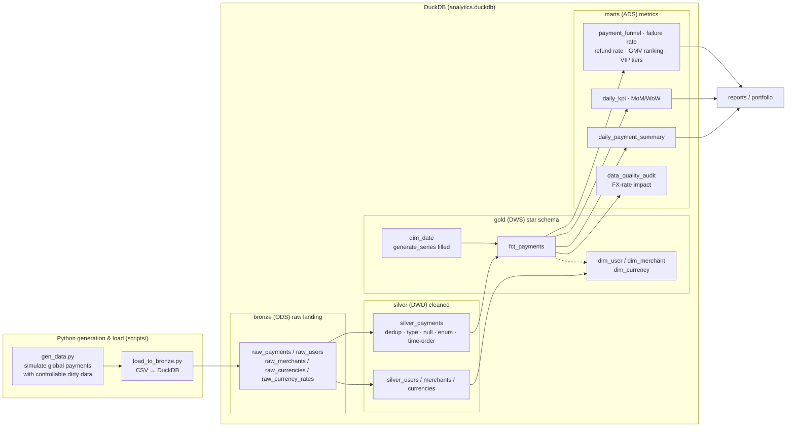
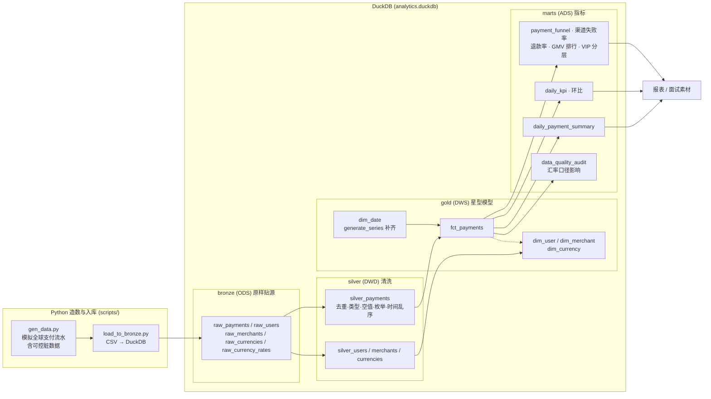

# Payment Analytics — End-to-End Payment Data Warehouse (dbt + DuckDB)

> Simulated global payment flows (500K rows) → DuckDB Bronze (raw) → dbt 4-layer warehouse
> (Bronze / Silver / Gold / Marts) → star schema → business metrics → data-quality tests → lineage graph.

A from-scratch **offline data warehouse** project, built around the **payment transactions** theme to tie
together **SQL + data warehousing + data quality**. Core material: **layering, star-schema modeling,
metric definitions, data cleaning, slow-query optimization**.

> Paired with [Payment Streaming](https://github.com/BeforeLanding/payment-streaming) (Kafka + Flink real-time)
> sharing the same simulated payment events and metric definitions — together the **Payment Transaction
> Data Platform**: real-time dashboard / risk control + T+1 reconciliation & deep analytics.

---

## 1. Architecture



**dbt auto lineage**: run `dbt docs generate` then `dbt docs serve` to browse the lineage graph of all 24 models online.

---

## 2. Tech Stack & Choices

| Tech | Version | Purpose | Why |
|---|---|---|---|
| Python | 3.12 | data generation / loading | mature ecosystem; native `csv` + `duckdb` reads — fast, no pandas memory |
| DuckDB | 1.5.5 | OLAP warehouse | **columnar, single file, `pip install` no-ops**; spend effort on modeling, not ops |
| dbt-core + dbt-duckdb | 1.12.3 / 1.11.0 | modeling / ELT "T" | `ref()` dependencies + auto lineage + data-quality tests + docs — the "engineering" in warehousing |
| Git + GitHub | — | version control / portfolio | showcase |

**Why not MySQL?** MySQL is row-store OLTP — slow aggregation, needs a server; DuckDB is columnar OLAP,
naturally fast for analytical queries.
**Why ELT, not ETL?** Land raw first, transform inside the warehouse; the source stays light and the
warehouse's compute (DuckDB) does the work — dbt *is* the ELT tool.

---

## 3. Directory Structure

```
payment_analytics/
├── scripts/
│   ├── gen_data.py          # generate raw CSVs (500K payments + dims, with controllable dirty data)
│   └── load_to_bronze.py    # CSV → DuckDB bronze layer (raw landing, idempotent)
├── models/
│   ├── sources.yml          # bronze source declarations
│   ├── bronze/              # 5 raw source views
│   ├── silver/              # 5 cleaned tables (with cleaning-flag columns)
│   ├── gold/
│   │   ├── dim/             # dim_user / dim_merchant / dim_date / dim_currency
│   │   └── fact/            # fct_payments
│   ├── marts/               # 9 metric / report / audit models
│   └── **/schema.yml        # data-quality test definitions (generic tests)
├── tests/                   # 5 custom singular tests
├── data/                    # raw CSVs (gitignored, rebuildable)
├── docs/                    # docs & diagrams
├── dbt_project.yml
└── README.md
```

---

## 4. Quick Start

```bash
# 1. Environment
pip install duckdb dbt-core dbt-duckdb
# Windows: export PYTHONUTF8=1 if Chinese text breaks

# 2. Generate data + load into the bronze layer (analytics.duckdb)
python scripts/gen_data.py
python scripts/load_to_bronze.py

# 3. Model (bronze → silver → gold → marts, 24 models total)
dbt run

# 4. Data-quality tests (52 total, incl. 5 custom monitoring tests)
dbt test

# 5. Lineage / docs
dbt docs generate
dbt docs serve
```

---

## 5. Data Description

`gen_data.py` simulates global payment flows: **500K payments over ~90 days**, 50K users, 2K merchants,
22 countries / 21 currencies (with USD FX rates and weekly-rate snapshots). `country_code` and `currency`
are **strongly consistent** (US↔USD, BR↔BRL…) to avoid unreal pairs like "US paying in JPY".

Deliberately injected dirty data (to demonstrate cleaning; ratios are configurable):

| Dirty data | Injected | Silver handling |
|---|---|---|
| duplicate `payment_id` | 2,500 rows | keep the earliest |
| null `country_code` | 4,000 rows | fill `'ZZ'` (unknown) |
| null `amount` | 1,500 rows | fill `0` + flag `amount_filled` |
| invalid `status` (`cancelled/chargeback/expired/Success/REFUND/null`) | 7,500 rows | normalize to 4 enum values |
| `paid_at < created_at` (time-order violation) | 2,500 rows | set to `created_at` |

---

## 6. Layered Models (interview: "why do you layer?")

| Layer | dbt schema | Tables | Responsibility |
|---|---|---|---|
| Bronze | `bronze` | 5 raw views | **ODS**: raw landing, faithful, imported by Python |
| Silver | `silver` | 5 cleaned tables | **DWD**: type unification, dedup, null/invalid handling, standardization, **keeps cleaning-flag columns for audit** |
| Gold | `gold` | 4 dim + 1 fact | **DWS**: star schema, business can join directly |
| Marts | `marts` | 9 metric tables | **ADS**: metric wide tables / report aggregates / data-quality audit |

Layering buys you: **isolation from source changes, reuse per layer, unified metric definitions,
permission governance** — the core narrative of warehouse modeling.

---

## 7. Star Schema (Gold layer)

```
        ┌───────────────┐
dim_user ───────► │               │ ◄── dim_date
dim_merchant ──► │ fct_payments  │
dim_currency ──► │               │
        └───────────────┘
```

| Table | Grain | Notes |
|---|---|---|
| dim_user | one row per user | surrogate key `user_key`; country, vip_level, registration date (SCD1 for now) |
| dim_merchant | one row per merchant | `merchant_key`; category, country |
| dim_date | one row per day | `date_key` (YYYYMMDD); `generate_series` filled over the data range |
| dim_currency | one row per currency | `currency_key`; `to_usd_rate` fixed FX rate |
| fct_payments | **one row per payment** | `payment_key`; dim FKs + original-currency amount + `amount_usd` + status + timestamps |

> **Depth point 1 — FX methodology**: the fact table **stores both** the original amount and `amount_usd`;
> reports aggregate in USD. This version uses a fixed rate (end-of-period snapshot); the daily-rate
> comparison is in §11 — difference ≈ **0.44%**.
>
> **Depth point 2 — grain**: fct grain = one payment (not one order line). **Refunds are modeled as
> independent negative facts** with `status='refunded'` (amount always positive, shown separately),
> not overwrites of the original row → supports independent refund analysis.

---

## 8. Metric Dictionary (definitions fixed; interview: "what's the numerator/denominator?")

| Metric | Definition / rule |
|---|---|
| Payment success rate | num = `status='success'` count; den = all count; attributed by `created_at` |
| GMV | Σ `amount_usd` (success only), attributed by `created_at` |
| Net GMV | GMV − Σ `amount_usd` (refunded) |
| Average order value | success GMV / success count |
| Refund rate | num = `refunded` count; den = `success` count |
| Failure rate (by channel) | `failed` count / that channel's total count |
| MoM/WoW | `lag()` window functions: day-over-day (dod), week-over-week (wow) |

---

## 9. Data Quality (dbt test)

**Generic tests (schema.yml)**: uniqueness, not-null, `accepted_values` enums, `relationships` FKs —
covering all of gold + key silver columns, 47 in total.

**Custom singular tests (tests/, 5)**:
- `test_success_rate_between_0_and_1` — success rate within [0,1]
- `test_fct_foreign_keys_all_resolve` — every fact FK resolves in a dimension (no orphan keys)
- `test_amounts_non_negative` — amounts always non-negative
- `test_daily_gmv_wow_drop_alert` — **monitoring mindset**: alert if daily GMV drops >30% WoW (excludes the not-yet-complete day)
- `test_dirty_rate_below_threshold` — upstream dirty-data rate <5%, guards against source degradation

**Cleaning outcome (from `marts.data_quality_audit`)**:

| Item | Amount |
|---|---|
| Bronze → Silver dedup | 2,500 rows removed |
| null country filled | 4,000 rows |
| null amount filled with 0 | 1,500 rows |
| invalid status normalized | 7,500 rows (1,270 of them case/alias variants) |
| time-order fixed | 2,500 rows |
| **overall dirty-data rate** | **2.83%** (< 5% threshold) |

> Pitfall: counting invalid statuses with SQL's `status NOT IN (...)` **silently misses NULLs**
> (NULL comparison returns unknown). Correct form: `status IS NULL OR lower(status) NOT IN (...)` —
> hard-coded in the audit model.

---

## 10. Performance Optimization (real numbers, "optimization" interview material)

> Scenario: business asks for daily × country GMV. Measured on 500K rows × 90 days in DuckDB:

| Approach | Implementation | Latency |
|---|---|---|
| ❌ slow | join 5 raw tables directly + **per-row correlated subquery for the day's FX rate** | **69.7 ms** |
| ✅ fast | query `marts.daily_payment_summary` directly (Gold pre-stores `amount_usd` + marts pre-aggregates) | **3.4 ms** (≈ **20×** faster) |

**Why it's fast**: move "per-row FX subquery + repeated joins" from query time to model time — the fact
table pre-stores `amount_usd`, reports only read pre-aggregated results. At tens-of-millions to
billions of rows, the gap is orders of magnitude (subqueries and repeated scans eliminated).

---

## 11. FX-Methodology Impact (`marts.currency_rate_impact`)

| Methodology | Success GMV (USD) |
|---|---|
| Fixed rate (this version's default, end-of-period snapshot) | 12,774,560.34 |
| Daily rate (weekly snapshot matched by payment day) | 12,718,160.87 |
| **Difference** | **≈ 0.44%** |

Conclusion: methodology differences are real → production reports **must pin and document the FX
methodology**, otherwise the same metric varies across reports.

---

## 12. Interview Depth Checklist

1. Why layer (isolate source changes / reuse / unified metrics / governance)
2. Why star schema (fast queries vs snowflake normalization cost)
3. How to set fact grain; **why model refunds independently**
4. **How to define the FX methodology** (store original + USD; fixed vs daily)
5. How to design data-quality tests (unique/not-null/enum/relationship/volatility monitoring)
6. Slow-SQL optimization process (§10 real before/after)
7. "How much dirty data did you clean" (§9: 2,500 duplicates, 2.83% dirty rate)
8. The SQL NULL pitfall (`NOT IN` misses NULL)

---

## 13. Future Work

- **Real-time (see [Payment Streaming](https://github.com/BeforeLanding/payment-streaming))**:
  same simulated payment events into Kafka → Flink minute-level aggregation → real-time dashboard.
- **SCD2**: track VIP-level history in dim_user (currently SCD1).
- **Daily FX**: join `fct` to a `dim_currency_rate` snapshot by `paid_at`, replacing the fixed rate.
- **Partitioning / incremental**: month-partition the fact table; `incremental` materialization instead of full rebuild.

---

## Disclaimer

All data is script-simulated, not real transaction data.

---

# 中文版 / Chinese Version

# Payment Analytics — 端到端支付交易数仓（dbt + DuckDB）

> 模拟全球支付流水（50 万行）→ DuckDB Bronze 贴源 → dbt 四层数仓（Bronze/Silver/Gold/Marts）
> → 星型模型 → 业务指标 → 数据质量测试 → 血缘图。
>
> 一个从 0 到 1 的离线数仓项目，用「支付交易」主题串起 **SQL + data warehousing + 数据质量**，
> 核心材料：**分层、星型建模、指标口径、数据清洗、慢查询优化**。

> 关联项目：[Payment Streaming](https://github.com/BeforeLanding/payment-streaming)（Kafka + Flink 实时流）
> 共用同一套「模拟支付事件」与指标口径，合起来讲**支付交易数据平台**：实时看板/风控 + T+1 对账与深度分析。

## 架构



**dbt 自动血缘**：`dbt docs generate` 后 `dbt docs serve`，可在线查看全部 24 张模型的血缘图。

## 技术栈与选型

| 技术 | 版本 | 用途 | 选型理由 |
|---|---|---|---|
| Python | 3.12 | 造数 / 入库 | 生态成熟，`csv` + `duckdb` 原生读取，快且免 pandas 内存 |
| DuckDB | 1.5.5 | OLAP 数仓载体 | **列式存储、单文件、`pip install` 免运维**；本地两周内把精力放建模而非运维 |
| dbt-core + dbt-duckdb | 1.12.3 / 1.11.0 | 数仓建模 / ELT 的 T | **ref() 依赖 + 自动血缘 + 数据质量测试 + 文档**，数仓"工程化"的体现 |
| Git + GitHub | — | 版本管理 / 作品展示 | 面试门面 |

**为什么不用 MySQL？** MySQL 是行存 OLTP，聚合慢、要装服务；DuckDB 列存 OLAP，分析查询天然快。
**为什么 ELT 而不是 ETL？** 先原样加载再在数仓内转换，源系统轻、利用数仓算力（DuckDB），dbt 即 ELT 工具。

## 快速开始

```bash
# 1. 环境
pip install duckdb dbt-core dbt-duckdb
# Windows 下如有中文编码问题，先 export PYTHONUTF8=1

# 2. 造数 + 入库（→ analytics.duckdb 的 bronze 层）
python scripts/gen_data.py
python scripts/load_to_bronze.py

# 3. 建模（bronze → silver → gold → marts，共 24 个模型）
dbt run

# 4. 数据质量测试（52 个，含 5 个自定义监控测试）
dbt test

# 5. 血缘图 / 文档
dbt docs generate
dbt docs serve
```

## 数据说明

`gen_data.py` 模拟全球支付流水：**50 万笔支付 × 近 90 天**、5 万名用户、2000 家商户、
22 个国家 / 21 种货币（含对 USD 汇率与按周汇率快照）。**country_code 与 currency 强一致**，
避免"US 付 JPY"这类不真实数据。

故意注入的脏数据（用于演示清洗，比例可调）：

| 脏数据 | 注入量 | Silver 处理 |
|---|---|---|
| `payment_id` 重复 | 2,500 行 | 保留最早一条 |
| `country_code` 空值 | 4,000 行 | 补 `'ZZ'`（未知） |
| `amount` 空值 | 1,500 行 | 补 `0` 并打标 `amount_filled` |
| `status` 非法值 | 7,500 行 | 归一化到 4 个枚举值 |
| `paid_at < created_at`（时间乱序） | 2,500 行 | 修正为 `created_at` |

## 分层模型

| 层 | dbt schema | 表 | 职责 |
|---|---|---|---|
| Bronze | `bronze` | 5 张贴源视图 | **ODS**：原样贴源、保真，由 Python 导入 |
| Silver | `silver` | 5 张清洗表 | **DWD**：类型统一、去重、空值/非法值处理、标准化，**保留清洗打标列供审计** |
| Gold | `gold` | 4 dim + 1 fct | **DWS**：星型模型，业务可直接 join |
| Marts | `marts` | 9 张指标表 | **ADS**：指标宽表 / 报表聚合 / 数据质量审计 |

## 星型模型（Gold 层）

| 表 | 粒度 | 说明 |
|---|---|---|
| dim_user | 每用户一行 | 代理键 user_key；country、vip_level、注册日期（本期 SCD1） |
| dim_merchant | 每商户一行 | merchant_key；分类、国家 |
| dim_date | 每天一行 | date_key（YYYYMMDD）；`generate_series` 按数据日期范围补齐 |
| dim_currency | 每币种一行 | currency_key；`to_usd_rate` 固定汇率 |
| fct_payments | **一笔支付单一行** | payment_key；各 dim 外键 + 原币金额 + `amount_usd` + 状态 + 时间 |

> **深度点 1 — 汇率口径**：事实表**双存**原币金额与 `amount_usd`，报表统一按 USD 汇总。本期用固定汇率（期末快照）；按日汇率对照见 §11，差异约 **0.44%**。
> **深度点 2 — 粒度**：fct 粒度 = 一笔支付单。**退款是独立 `status='refunded'` 的负向事实**（金额恒正、单独列示），不覆盖原单 → 支持独立退款分析。

## 指标字典

| 指标 | 定义 / 口径 |
|---|---|
| 支付成功率 | 分子 = `status='success'` 单数；分母 = 全部单数；按 `created_at` 归属日期 |
| GMV | Σ `amount_usd`（仅 success），按 `created_at` 归属 |
| 净 GMV | GMV − Σ `amount_usd`（refunded） |
| 客单价 | 成功支付 GMV / 成功支付单数 |
| 退款率 | 分子 = `refunded` 单数；分母 = `success` 单数 |
| 失败率（分渠道） | `failed` 单数 / 该渠道全部单数 |
| 环比 | `lag()` 窗口函数：日环比（dod）、周环比（wow） |

## 数据质量（dbt test）

**Generic tests（schema.yml）**：唯一、非空、枚举 `accepted_values`、外键 `relationships`，共 47 个。
**自定义单测（tests/，5 个）**：成功率区间 [0,1]；事实表外键全解析（无孤儿键）；金额恒非负；
**日 GMV 周环比骤降 >30% 告警**（监控思维）；**脏数据率 <5%** 阈值监控。

**清洗结果（`marts.data_quality_audit`）**：去重 2500 行、空 country 补齐 4000 行、空 amount 补 0 1500 行、
非法 status 归一化 7500 行（其中 1270 行为大小写/别名）、时间乱序修复 2500 行，**整体脏数据率 2.83%**（<5% 阈值）。

> 踩坑：`status NOT IN (...)` 会**漏掉 NULL**（NULL 比较返回 unknown）。正确写法是
> `status IS NULL OR lower(status) NOT IN (...)`——本项目已在审计模型里写死。

## 性能优化记录

| 写法 | 实现 | 耗时 |
|---|---|---|
| ❌ 慢 | 直接在 `bronze` raw 层 5 表关联 + **每行相关子查询取当日汇率** | **69.7 ms** |
| ✅ 快 | 直接查 `marts.daily_payment_summary`（Gold 已预存 `amount_usd` + marts 预聚合） | **3.4 ms**（≈ **20×**） |

**为什么快**：把"每行做汇率子查询 + 重复 join"从查询期挪到建模期——事实表预存 `amount_usd`，报表只读预聚合结果。数据量到千万/亿级时差异是数量级的。

## 汇率口径影响分析

| 口径 | 成功单 GMV（USD） |
|---|---|
| 固定汇率（本期默认，期末快照） | 12,774,560.34 |
| 按日汇率（周快照按支付日匹配） | 12,718,160.87 |
| **差异** | **≈ 0.44%** |

结论：口径差异真实存在 → 生产报表必须**把汇率口径写死并文档化**，否则同一指标在不同报表口径不一。

## 面试可讲的 depth 清单

1. 为什么分层（隔离源变更 / 复用 / 口径统一 / 权限治理）
2. 为什么星型（查询快 vs 雪花规范化成本）
3. 事实表粒度怎么定、**退款为什么独立建模**
4. **汇率口径怎么定义**（原币 + USD 双存，固定 vs 按日）
5. 数据质量测试怎么设计（唯一/非空/枚举/关系/波动监控）
6. 慢 SQL 优化过程（真实前后对比）
7. "清掉了多少脏数据"（2500 重复、2.83% 脏数据率）
8. SQL NULL 坑（`NOT IN` 漏掉 NULL）

## 未来工作

- **实时方案**：见 [Payment Streaming](https://github.com/BeforeLanding/payment-streaming)，同一套模拟支付事件接 Kafka → Flink 分钟级聚合 → 实时看板。
- **SCD2**：dim_user 记录 vip 等级历史变更（本期 SCD1）。
- **按日汇率**：fct 按 `paid_at` 关联 `dim_currency_rate` 快照，替换固定汇率。
- **分区 / 增量**：事实表按月分区，`incremental` 物化替代全量重建。

*免责声明：所有数据均为脚本模拟生成，非真实交易数据。*
